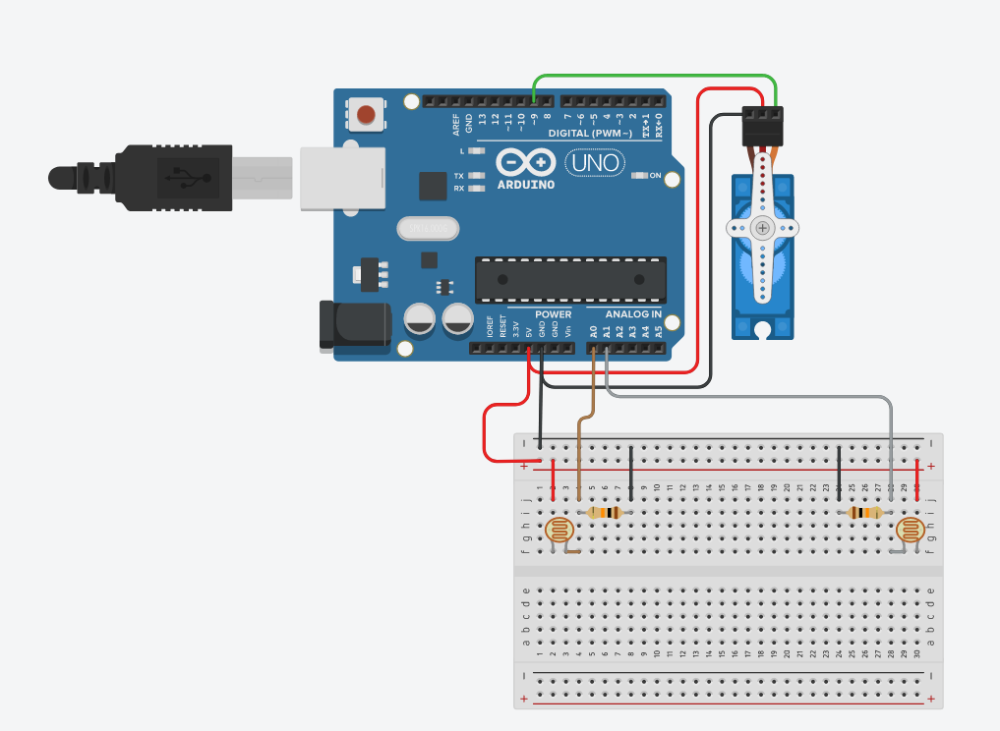
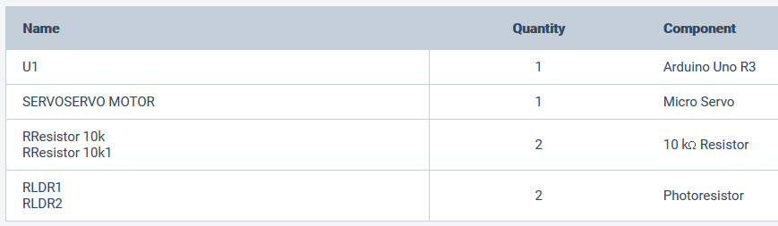
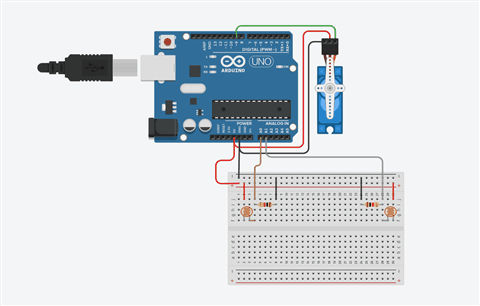

# Track Me Sun

Automatic Sun Tracker using Arduino Uno Rev3

* Programming Language: C
* Microcontroller: Arduino Uno R3 
* Tools: TinkerCAD

Features:

1. Tracks Sun
2. If the Sun runs away, refer 1.

Schematic design for Arduino Uno:

Bill of Materials:

How Does it Work:
* It looks for the sun via the LDR sensor
* If both LDR sensor registers the same value, it stops indicates that they have found the sun
* If both LDR sensor value does not match, the servo motor keeps looping until it finds the sun

© Ahmad Siraj MY 2020
